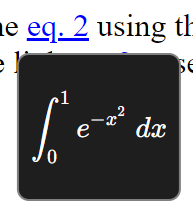

# *tex-math*

Provides `i-math` and `tex-math` elemets to display math equations.

<!-- see https://stackoverflow.com/questions/6551446/can-i-run-html-files-directly-from-github-instead-of-just-viewing-their-source -->
Live [example](https://raw.githack.com/lucaciucci/tex-math/main/examples/index.html)

## Usage
Anywere in your html code, for example in the `head` tag:
```html
<!-- load the script as async, this is not necessary but may speed up page rendering, remove 'async' if you need to access the elements instantly -->
<script async src="https://cdn.jsdelivr.net/npm/tex-math@1.3.3/dist/tex-math.js"></script>
```
and then you can use `i-math` and `tex-math` tags to write math:
```html
Inline equation example: <i-math>x^y</i-math>
Equation:
<tex-math>
    i \hbar \frac{\partial}{\partial t} \psi = H \psi
</tex-math>
```

### Updating math
If you change the content of the tag, the math display is automatically updated:
```html
<tex-math id="equation">
    i \hbar \frac{\partial}{\partial t} \psi = H \psi
</tex-math>

<script>
    // get the element, the class is TexMath (derived from HTMLElement)
    eq = document.getElementById("equation");

    // get the current Tex representation
    console.log("old tex: ", eq.tex);

    // change the Tex code
    eq.tex = "\\int_0^1{e^{-x^{2}} \\; dx}";

    // alternatively, you can directly change the element content
    // in different ways, e.g.:
    // eq.textContent = "\\int_0^1{e^{-x^{2}} \\; dx}";
    // eq.innerHTML   = "\\int_0^1{e^{-x^{2}} \\; dx}";
</script>
```

### Styling
`tex-math.js` loads a basic stylesheed to correctly display the elements and allowing proper styling. It is advised to add a `<style>` tag to your html code to allow a nice rendering even before the script is loaded (unnecessary if the script is loaded without the `async` attribute):
```html
<style>
    i-math { display: inline-block; }
    tex-math { display: block; }
</style>
```

### Equation numbering
if you want to display equation numbers, you can load the [lc-ref](https://www.npmjs.com/package/lc-ref) package and then you can set one of the following attributes to display the equations numbers:
 - `id`
 - `n`
 - `number`
for example:
```html
<tex-math id="equation">
    x^2
</tex-math>
or...
<tex-math n>
    x^2
</tex-math>
or...
<tex-math number>
    x^2
</tex-math>
```

### Referencing equations:
you can use the [lc-ref](https://www.npmjs.com/package/lc-ref) package to reference equations:
```html
<lc-ref ref="equation">eq. </lc-ref>
or...
<lc-ref href="#equation">eq. </lc-ref>
or...
<lc-ref href="./other_document.html#equation">eq. </lc-ref>
```
authomatic preview will be displayed on hover:  


### Importing as module:
```typescript
import { TexMath, IMath, setupStyles } from "tex-math/lib/tex-math"
```

## Features
 - [x] inline equation
 - [x] math sidpaly equations
 - [x] authomatic update
 - [ ] LaTeX code "copy to clipboard"
 - [x] equation numbering using the [lc-ref](https://www.npmjs.com/package/lc-ref) package
 - [ ] error recovery?
 - [ ] equation editor

legend:
 - [x] OK
 - [ ] to implement


## How does it work
TODO

## TODOs
 - improve node's import